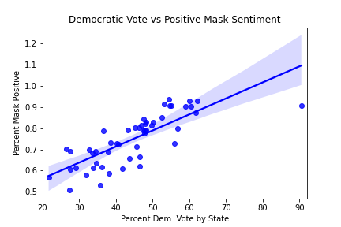
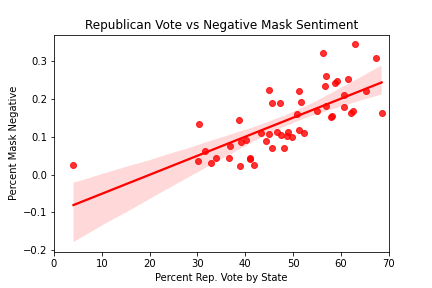
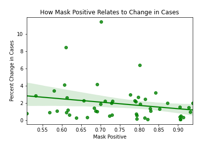
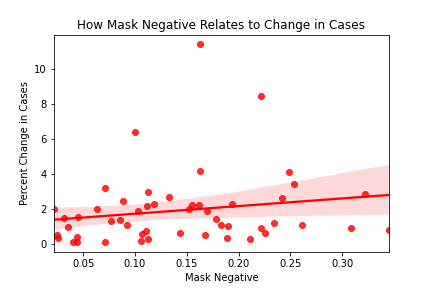
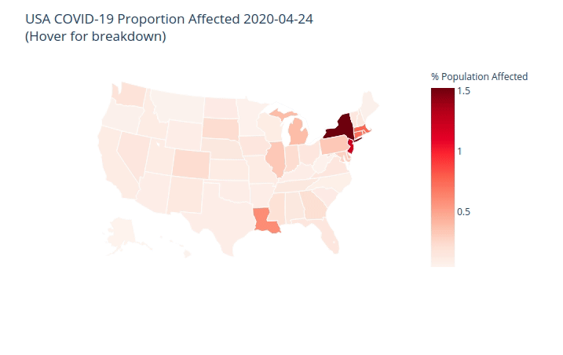
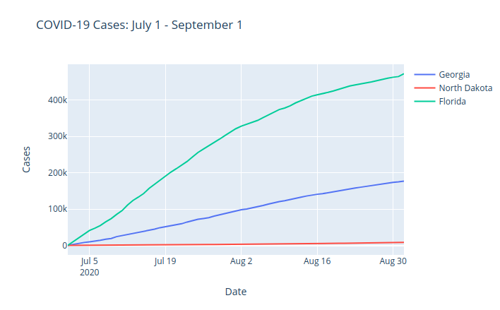
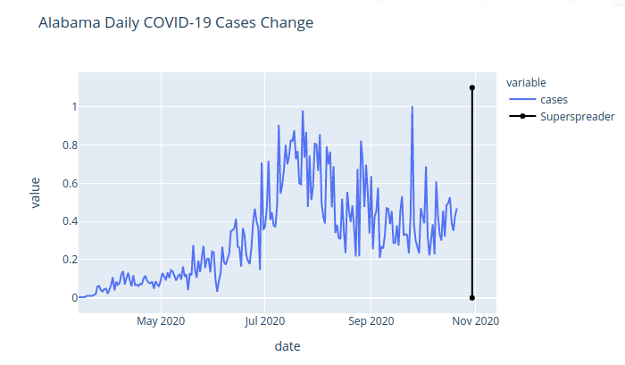

The virus picture was sourced from the CDC as seen in this [article](https://www.statnews.com/2020/02/11/disease-caused-by-the-novel-coronavirus-has-name-covid-19/) and edited in [GIMP](https://www.gimp.org)
# Project-5: COVID-19 Analysis

Access to COVID-19 data is no issue. Any simple google search will reveal that major news sources, education and research instutions are publishing data in droves. The most brilliant minds of our time are coming together to fight a single global health pandemic. 

### Some Notable Examples
* [CDC](https://covid.cdc.gov/covid-data-tracker/#cases_casesinlast7days)
* [WHO](https://github.com/WorldHealthOrganization/app)
* [John Hopkins University](https://coronavirus.jhu.edu/covid-19-daily-video)
* [Our World in Data](https://ourworldindata.org/coronavirus)
* [The New York Times](https://github.com/nytimes/covid-19-data)
* [Tokyo Metropolitan Government](https://github.com/tokyo-metropolitan-gov/covid19)
* [COVID in India](https://github.com/covid19india/covid19india-react)

General Assembly's DSI-824 cohort has requested a project with specific goals:
- Preparing for emergencies,
- Rapidly responding to emergencies, and/or 
- Estimating the economic impact of disasters.

However, we are now in a world where there is too much data: a Data Scientist's dream. 
Team V.A.V. has put together a suite of three applications that can be combined into an additional dashboard.

* [U.S. COVID Snapshots](https://dsir824-covid19-example.herokuapp.com)
* [Daily Change in COVID cases](http://covid-by-state.herokuapp.com)
* [Plot COVID-19 Rates](https://covid-plot-states.herokuapp.com)

# Problem Statements

## What does COVID-19 look like today and what are the stories the data says?

Due to the nature of the kind of problem, such a statement has been segmented into 
four ideas:

* #### Why is a project like this worthwhile?

* #### How has the virus progressed in the U.S. since February 2020?

* #### How does mask sentiment look across the U.S. and how does it affect case growth?

* #### How does mask sentiment vary by state, and does mask sentiment differentially affect COVID-19 growth rates?

# Executive Summary

Uniquely during the COVID-19 pandemic we have a health issue, a political issue and a misinformation issue which all feed into one. To combat two of the three: political and misinformation, Team V.A.V has developed a suite of tools which combine data from the New York Times and Our World in Data for a political view on the current pandemic crisis. By considering mask sentiment data (how one feels about wearing a mask) and the numbers, we show a bigger picture of the current social chasm that the U.S. is currently battling through. 

# Table of Contents

- [Project-5: COVID-19 Analysis](#project-5--covid-19-analysis)
    + [Some Notable Examples](#some-notable-examples)
- [Problem Statements](#problem-statements)
  * [What does COVID-19 look like today and what are the stories the data says?](#what-does-covid-19-look-like-today-and-what-are-the-stories-the-data-says-)
      - [Why is a project like this worthwhile?](#why-is-a-project-like-this-worthwhile-)
      - [How has the virus progressed in the U.S. since February 2020?](#how-has-the-virus-progressed-in-the-us-since-february-2020-)
      - [How does mask sentiment look across the U.S. and how does it affect case growth?](#how-does-mask-sentiment-look-across-the-us-and-how-does-it-affect-case-growth-)
      - [How does mask sentiment vary by state, and does mask sentiment differentially affect COVID-19 growth rates?](#how-does-mask-sentiment-vary-by-state--and-does-mask-sentiment-differentially-affect-covid-19-growth-rates-)
- [Executive Summary](#executive-summary)
- [Table of Contents](#table-of-contents)
- [Data and Methodology:](#data-and-methodology-)
- [Findings](#findings)
  * [US COVID Snapshots - Vivian Nguyen](#us-covid-snapshots---vivian-nguyen)
  * [Plotting COVID-19 Rates - Alex Fioto](#plotting-covid-19-rates---alex-fioto)
  * [Plotting Daily Changes in COVID Cases - Varun Mohan](#plotting-daily-changes-in-covid-cases---varun-mohan)
- [Future](#future)
- [File Structure](#file-structure)
- [Data Dictionaries](#data-dictionaries)
  * [sme.csv](#smecsv)
  * [covid_metrics_full_time.csv](#covid-metrics-full-timecsv)
- [Additional Resources](#additional-resources)

<small><i><a href='http://ecotrust-canada.github.io/markdown-toc/'>Table of contents generated with markdown-toc</a></i></small>


# Data and Methodology:

The New York Times has done much of the hard work for data acqusition, regularlly compiling daily and weekly COVID metrics. 

Our process for Exploratory Data Analysis was an open ended search in finding the story inside the data as follows:

1. Identify Correlations in the overall dataset
2. Using correlations, plot COVID metrics against numerical features such as political alignment and mask sentiment
3. Deep dive into specific states to tell two different stories in the United States

# Findings

Going into our exploration, Team V.A.V held some preconcieved biases about what we would find.

* There is a correlation between a mask-state and its voting history in 2016.

We found out that our initial assumptions are true:




We can classify the voting history of a state to its surveyed mask usage sentiment taken in July 2020. States that voted Republican in 2016 are leading in negative mask sentiment (a negative response to the idea of wearing a mask)




Looking at mask sentiment vs percent change, we can see a very small linear correlation however it gives evidence to the idea that masks alone are not enough. We need a large commanded response to COVID-19. Individual activity is not enough.

To emphasize this, Team V.A.V. has deployed 3 interactive apps to Heroku that can be used right now:

## US COVID Snapshots - Vivian Nguyen

* [Heroku: US Covid Metric Snapshots](https://dsir824-covid19-example.herokuapp.com)
    * [Source Code for Application](https://github.com/ga-dsir824-collab/covid19-over-time)
    * This is a choropleth map of the United States comparing true metrics to proportional metrics over time. The map shows that this goes from a state-to-state 
    
## Plotting COVID-19 Rates - Alex Fioto

* [Heroku: Plotting COVID-19 Rates](https://covid-plot-states.herokuapp.com)
    * [Source Code]()
    * This is an interactive line plot of comparing actual state by state COVID metrics with some humor

## Plotting Daily Changes in COVID Cases - Varun Mohan

* [Heroku: Plotting Daily Changes in COVID Cases](http://covid-by-state.herokuapp.com)
    * [Source Code](https://github.com/vmohan96/P5_Flask_App)
    * This is an interactive line plot showing COVID metrics, regime states and marking super spreader events.
    
# Future

The data that we used to deploy these apps are static, but it would not be difficult to have dynamically updating applications which pull from databases weekly. This would be the first course of action. 

# File Structure


```bash
project-5
├── 01.1-EDA_summarized-alex.ipynb
├── 02-Creating_Datasets.ipynb
├── 03.1-Modeling-alex.ipynb
├── 03.2-Modeling-varun.ipynb
├── assets
│   ├── images
│   │   ├── alex_app.png
│   │   ├── banner.png
│   │   ├── democrat_mask.png
│   │   ├── neg_mask_cases.png
│   │   ├── pos_mask_cases.png
│   │   ├── republican_mask.png
│   │   ├── varun_app.png
│   │   └── vivian_app.png
│   └── raw
│       └── banner.xcf
├── data
│   ├── covid_metrics_full_time.csv
│   ├── final_alex_eda_dataframe.csv
│   └── sme.csv
├── project.md
├── README.md
└── scratch_work
    ├── alex
    │   └── Alex_scratch_work
    ├── data
    │   └── Scratch_data
    ├── varun_stuff
    │   └── Varun_scratch_work
    └── vivian_fork
        └── Vivian_scratch_work

13 directories, 72 files
```

# Data Dictionaries

## sme.csv

This data was combined from these sources:
* [NYTimes COVID](https://github.com/nytimes/covid-19-data)
* [2016 Presidential Election](https://worldpopulationreview.com/state-rankings/2016-election-results-by-state)

|    name     |  type   | description |
|-------------|---------|-------------|
STATE         | object  | U.S. State
NEVER         | float64 | NYT Survey: Survey Response of Mask Sentiment
RARELY        | float64 | NYT Survey: Survey Response of Mask Sentiment
SOMETIMES     | float64 | NYT Survey: Survey Response of Mask Sentiment
FREQUENTLY    | float64 | NYT Survey: Survey Response of Mask Sentiment
ALWAYS        | float64 | NYT Survey: Survey Response of Mask Sentiment
mask_negative | float64 | Engineered Column: NEVER + RARELY
mask_positive | float64 | Engineered Column: SOMETIMES + FREQUENTLY + ALWAYS
votesDem      | int64   | 2016 Election: Democratic Votes
percD         | float64 | 2016 Election: % Democratic Voters
votesRep      | int64   | 2016 Election: Republican Voters
percR         | float64 | 2016 Election: % Republican Voters
electoralDem  | int64   | 2016 Election: Democratic Electoral College Count
electoralRep  | int64   | 2016 Election: Republican ELectoral College Count
Pop           | int64   | 2016 Election: Population of U.S. State
blue          | int64   | Engineered Column: Boolean for political party
red           | int64   | Engineered Column: Boolean for political party


## covid_metrics_full_time.csv

Source:
* [NYTimes COVID](https://github.com/nytimes/covid-19-data)

| name  |  type  |description|
|-------|--------|-----------|
|date   | object | Date Data Collected
|state  | object | U.S. State
|fips   | int64  | Federal Information Processing Standards: State Label
|cases  | int64  | Cumulative Count of COVID-19 Cases
|deaths | int64  | Cumulative Count of COVID-19 Deaths

# Additional Resources

We found this cool package to handle FIPS to States conversion:
* [us_states](https://github.com/unitedstates/python-us)