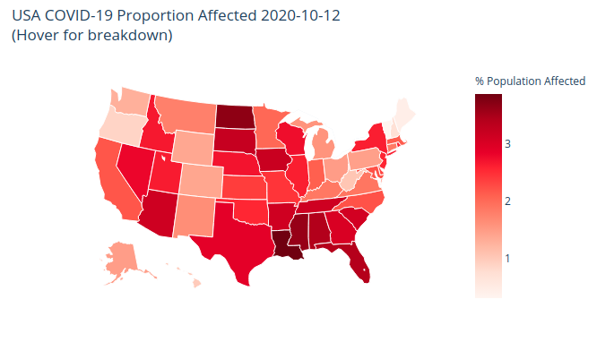

The virus picture was sourced from the CDC as seen in this [article](https://www.statnews.com/2020/02/11/disease-caused-by-the-novel-coronavirus-has-name-covid-19/) and edited in [GIMP](https://www.gimp.org)
# Project-5: COVID-19 Analysis

Access to COVID-19 data is no issue. Any simple google search will reveal that major news sources, education and research instutions are publishing data in droves. The most brilliant minds of our time are coming together to fight a single global health pandemic. 

### Some Notable Examples:
* [CDC](https://covid.cdc.gov/covid-data-tracker/#cases_casesinlast7days)
* [WHO](https://github.com/WorldHealthOrganization/app)
* [John Hopkins University](https://coronavirus.jhu.edu/covid-19-daily-video)
* [Our World in Data](https://ourworldindata.org/coronavirus)
* [The New York Times](https://github.com/nytimes/covid-19-data)
* [Tokyo Metropolitan Government](https://github.com/tokyo-metropolitan-gov/covid19)
* [COVID in India](https://github.com/covid19india/covid19india-react)

General Assembly's DSI-824 cohort has requested a project with specific goals:
- preparing for emergencies,
- rapidly responding to emergencies, and/or 
- estimating the economic impact of disasters.

We have put together a suite of three applications that can be combined into an additional dashboard.

* [U.S. COVID Snapshots](https://dsir824-covid19-example.herokuapp.com)
* [Daily Change in COVID cases](http://covid-by-state.herokuapp.com)
* [Plot COVID-19 Rates](https://covid-plot-states.herokuapp.com)

## Problem Statements:

### What does COVID-19 look like today and what are the stories the data says?

Due to the nature of the kind of problem, such a statement has been segmented into 
four ideas:

* #### Why is a project like this worthwhile?

* #### How has the virus progressed in the U.S. since February 2020?

* #### How does mask sentiment look across the U.S. and how does it affect case growth?

* #### How does mask sentiment vary by state, and does mask sentiment differentially affect COVID-19 growth rates?

## Executive Summary:

Misinformation 

## Table of Contents

make a fancy hyperlink section here

explain how to look at our repo

### List of Deployed Applications:

#### Vivian Nguyen

* [Heroku: US Covid Metric Snapshots](https://dsir824-covid19-example.herokuapp.com)
    * [Source Code for Application](https://github.com/ga-dsir824-collab/covid19-over-time)
    
#### Alex Fioto

* App
    * Source Code

#### Varun Mohan

* App
    * Source Code

## Data and Methodology:

show raw data that we found, put here

show how we modified the data, add data engineering

show our process to finding potential solutions for our problem statements

talk about data limitations about mask sentiment

## Findings:

talk about what we found

talk about visualizations

talk about our hypothesis

## Future:

talk about future development

## File Structure


```bash

```

## Data Dictionaries

### sme.csv

This data was combined from these sources:
* [NYTimes COVID](https://github.com/nytimes/covid-19-data)
* [2016 Presidential Election](https://worldpopulationreview.com/state-rankings/2016-election-results-by-state)

|    name     |  type   | description |
|-------------|---------|-------------|
STATE         | object  | U.S. State
NEVER         | float64 | NYT Survey: Survey Response of Mask Sentiment
RARELY        | float64 | NYT Survey: Survey Response of Mask Sentiment
SOMETIMES     | float64 | NYT Survey: Survey Response of Mask Sentiment
FREQUENTLY    | float64 | NYT Survey: Survey Response of Mask Sentiment
ALWAYS        | float64 | NYT Survey: Survey Response of Mask Sentiment
mask_negative | float64 | Engineered Column: NEVER + RARELY
mask_positive | float64 | Engineered Column: SOMETIMES + FREQUENTLY + ALWAYS
votesDem      | int64   | 2016 Election: Democratic Votes
percD         | float64 | 2016 Election: % Democratic Voters
votesRep      | int64   | 2016 Election: Republican Voters
percR         | float64 | 2016 Election: % Republican Voters
electoralDem  | int64   | 2016 Election: Democratic Electoral College Count
electoralRep  | int64   | 2016 Election: Republican ELectoral College Count
Pop           | int64   | 2016 Election: Population of U.S. State
blue          | int64   | Engineered Column: Boolean for political party
red           | int64   | Engineered Column: Boolean for political party


### covid_metrics_full_time.csv

Source:
* [NYTimes COVID](https://github.com/nytimes/covid-19-data)

| name  |  type  |description|
|-------|--------|-----------|
|date   | object | Date Data Collected
|state  | object | U.S. State
|fips   | int64  | Federal Information Processing Standards: State Label
|cases  | int64  | Cumulative Count of COVID-19 Cases
|deaths | int64  | Cumulative Count of COVID-19 Deaths

## Additional Resources

We found this cool package to handle FIPS to States conversion:
* [us_states](https://github.com/unitedstates/python-us)